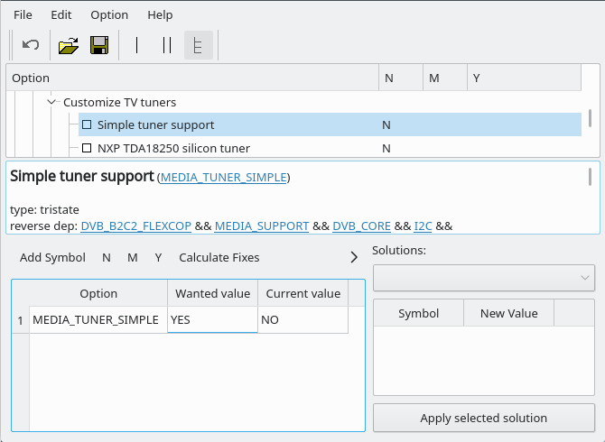
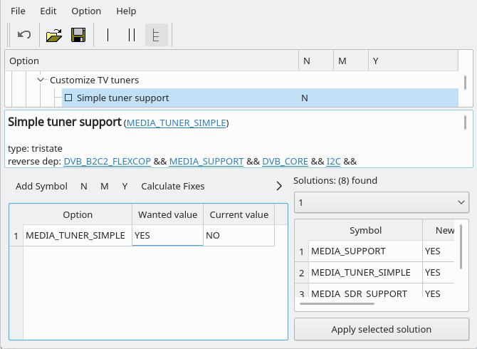

# configfix

*configfix* is a tool to resolve conflicts for configuration options in the Linux kernel that have unmet dependencies. It is built as an extension of xconfig.

 

----

## Background

The vast majority of the configuration options in the Linux kernel have some kind of dependency relationship to one or several other options. An option cannot be configured as long as its dependencies are not satisfied. Consequently, these dependencies have to be taken into account when the user wants to configure an option.

While the various kernel configurators (xconfig, gconfig, menuconfig etc.) can display existing dependencies, they do not show whether all dependencies are met and, more importantly, which configuration changes must be made in order to be able to configure (i.e., select/deselect) a given configuration option.  If a user wants to enable option X, they will need to spend a lot of time understanding all the existing dependencies and figure out how to satisfy them.

We have therefore developed a conflict-resolution algorithm integrated right within *xconfig*. In this context, a conflict is when the selection/deselection of a kernel option violates an existing Kconfig dependency. The user can specify a configuration options and the value they wish to set this option to. configfix will then suggest a list of configuration options to be changed in order to satisfy the dependencies.

## Prerequisites

As configfix is integrated within xconfig, it needs xconfig to run.

*  For xconfig:

    *  For Debian/Ubuntu: `apt install pkg-config g++ qtbase5-dev`

## Instructions

1. Clone or download the configfix repository for [v5.13](https://github.com/delta-one/linux/tree/copy_patch_v5.13) or for [v.6.10](https://github.com/delta-one/linux/tree/copy_patch_v6.10).
2. Download the corresponding kernel source tree from [the official archives](https://www.kernel.org/) and extract it.
3. Run `copy_files.sh /path/to/KERNEL_SOURCE_TREE` in the configfix repository.
4. Make sure that a `.config` is present in `KERNEL_SOURCE_TREE`.
5. Run `make xconfig` in your extracted source tree.

If the bottom panel is invisible, you need to drag it up. See the following screenshots.

## Exporting constraints

The constraints as well as the SAT problem in DIMACS can be exported into text files. Run `make cfoutconfig` in the extracted source tree to export everything. In [this repository](https://bitbucket.org/tberger/variability-models/src/master/) at `/kconfig/abstraction`, as well as here at [`/dimacs`](https://bitbucket.org/easelab/configfix/src/master/dimacs/), already exported constraints in DIMACS format are available.

## Limitations

* Some conflicts can be fixed using various alternative fixes. We currently limit the number of proposed fixes to 3 for performance reasons. While every proposed fix should still result in the desired outcome, the solutions can be suboptimal in some cases. For example, an option can be enabled while still being invisible in the configurator.
* The tool is somewhat memory-hungry. Currently, it needs close to 1  GB of RAM to resolve conflicts.
* The *Apply Fix*-button will try to apply all values from the selected fix. Sometimes it is not possible to set all values. In this case, please report the issue (see below).

## Contributing

Contributions to the project are appreciated. You can help, even if you are not a developer/programmer:

1. If you come across a conflict that cannot be solved or where configfix produces a wrong solution, please report the issue.
2. Merge requests to improve the code/performance or to fix bugs are highly appreciated as well.

## Main Paper

* Patrick Franz, Thorsten Berger, Ibrahim Fayaz, Sarah Nadi, and Evgeny Groshev (2021). "ConfigFix: Interactive Configuration Conflict Resolution for the Linux Kernel". In: *2021 IEEE/ACM 43rd International Conference on Software Engineering: Software Engineering in Practice (ICSE-SEIP)*, pp. 91–100. doi: 10.1109/ICSE-SEIP52600.2021.00018
 * Available at [arxiv.org](https://arxiv.org/pdf/2012.15342)

## Credits

* Patrick Franz (University of Gothenburg) `<deltaone@debian.org>`
* Ibrahim Fayaz (VecScan AB) `<phayax@gmail.com>`
* Thorsten Berger (Chalmers | Ruhr University Bochum) `<thorsten.berger@rub.se>`
* Sarah Nadi (NYU Abu Dhabi) `<sarah.nadi@nuy.edu>`
* Evgeny Groshev (Chalmers | University of Gothenburg) `<groshev@student.chalmers.se>`
* Lukas Günther (Ruhr University Bochum) `<lukas.guenther@rub.de>`
* Dorina Sfirnaciuc (Ruhr University Bochum) `<dorina.sfirnaciuc@rub.de>`
* Jude Gyimah (Ruhr University Bochum) `<jude.gyimah@rub.de>`
* Jan Sollman (Ruhr University Bochum) `<jan.sollman@rub.de>`
* Ole Schürks (Ruhr University Bochum) `<ole.schuerks@rub.de>`
